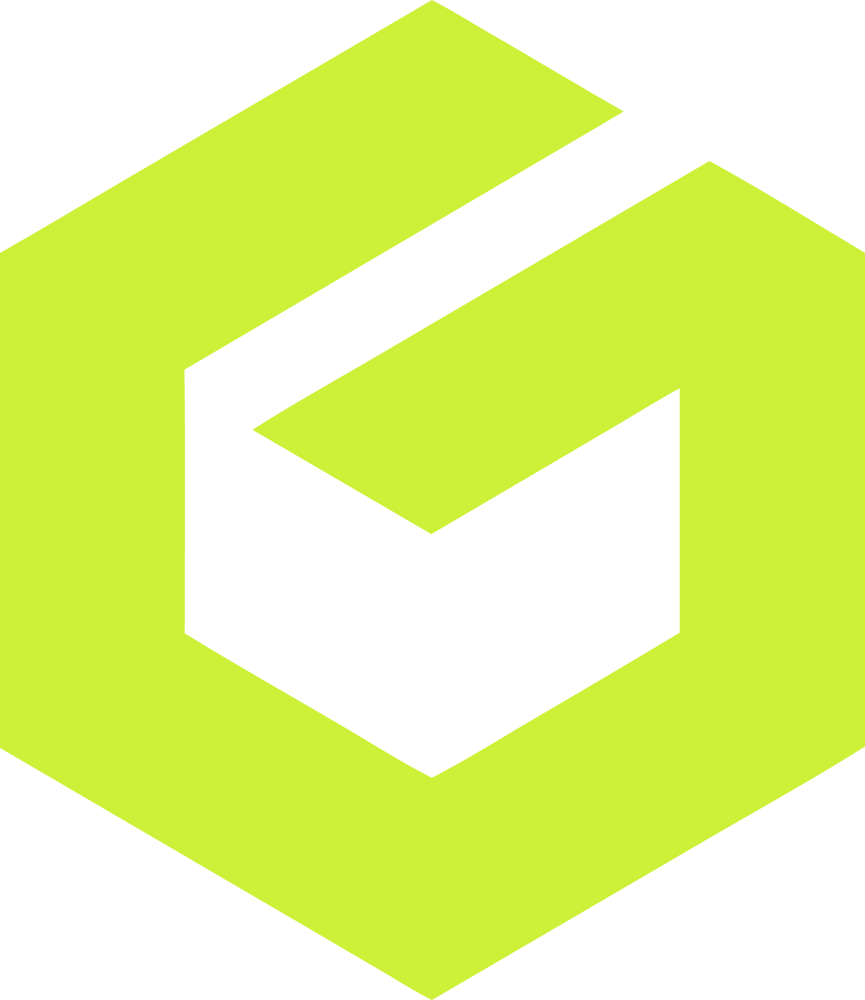
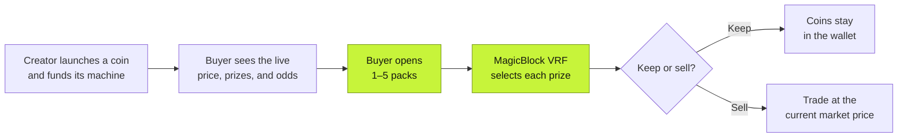

# Gabox

**Launch a coin. Build its machine. Open a pack and see what you pull.**

[gabox.fun](https://gabox.fun) · [Program](https://github.com/gabox-labs/gabox-program) · [TypeScript SDK](https://github.com/gabox-labs/gabox-sdk) · [hello@gabox.fun](mailto:hello@gabox.fun)

Gabox is a marketplace of onchain gacha machines. Each machine belongs to a newly launched coin. Creators choose the prize tiers and odds; buyers open packs to win that coin. The price of a pack follows the coin's market, and the prize comes from tokens already in the machine's vault.

## The loop

1. **Launch.** Create a new coin and its machine in one transaction. Set the prize tiers and odds, then seed the vault so the first prizes can be paid.
2. **Choose.** Browse machines and see the current pack price, prize amounts, and odds before buying. A pack buys a fixed amount of the machine's coin from its market.
3. **Open.** Buy up to five packs at once. MagicBlock VRF picks a tier for each one, and the prize coins land in your wallet.
4. **Keep or sell.** Hold the coins or sell them through the coin's market at its current price.

## How the machine stays honest

- **Odds are public.** The creator's weighted prize tiers are fixed when the machine launches.
- **Prizes are funded.** Before the draw, Gabox caps the displayed prizes to available vault inventory and reserves enough tokens for the purchase.
- **The draw is frozen.** Its tiers and available inventory are snapshotted when you buy, so a later purchase cannot change the rules for your packs.
- **The result is checkable.** MagicBlock VRF supplies the randomness, and onchain events record the inputs and outcome of each purchase.

Each coin starts on a **Meteora DBC bonding curve** and trades in a **Meteora DAMM v2 pool** after graduation. Market prices can move, and a pack can return fewer tokens or less market value than it cost.

## At a glance

| | |
| --- | --- |
| **What you open** | Packs of a newly launched coin |
| **Pack size** | 1,000,000 tokens, or 0.1% of the coin's initial supply |
| **Prizes** | Up to eight weighted tiers, set at launch |
| **Randomness** | MagicBlock VRF |
| **Market** | Meteora DBC, then Meteora DAMM v2 |

## Status

> [!NOTE]
> The Meteora version is deployed on **Solana devnet**. [gabox.fun](https://gabox.fun) is currently a wallet-gated preview. The [deployment record](https://github.com/gabox-labs/gabox-program/blob/main/DEPLOYMENT.md) lists the deployed build and remaining launch work.

Building with Gabox? Start with the [onchain program](https://github.com/gabox-labs/gabox-program) and [TypeScript SDK](https://github.com/gabox-labs/gabox-sdk).

---

Questions, feedback, or a coin you want to launch? [hello@gabox.fun](mailto:hello@gabox.fun)

