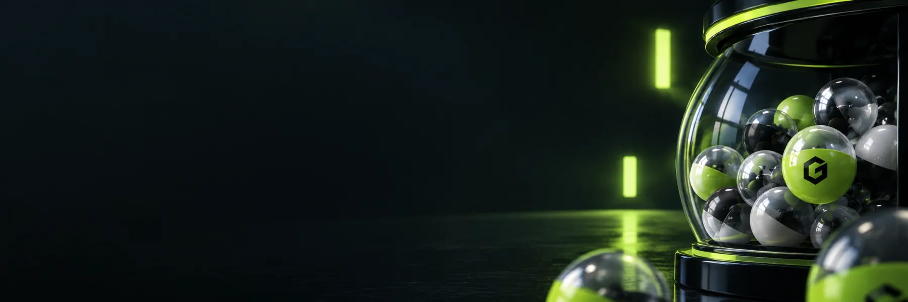

# Gabox

**Launch a coin. Open packs. See what you pull.**

[Visit Gabox](https://gabox.fun) · [Explore the program](https://github.com/gabox-labs/gabox-program) · [Get in touch](mailto:hello@gabox.fun)

Gabox is a gacha marketplace on Solana. Each machine belongs to a new coin. Its creator sets the prize tiers and odds, then seeds the machine with coins. Buyers open packs for a chance at those coins.

## How it works

1. **Launch a machine.** Create a coin and its machine together. Choose the prize tiers and fund the first prizes.
2. **Open packs.** Pick a machine, check its live price and odds, and buy one to five packs. MagicBlock VRF selects each prize.
3. **Keep or sell.** Prize coins go to your wallet. Keep them or sell them at the coin's current market price.

The coin trades on a Meteora DBC curve and, after graduation, in a Meteora DAMM v2 pool. Pack prices follow that market. Prize tokens are held in the machine's vault, and each draw reserves what it can pay before randomness arrives.

**Current status:** The Meteora version is deployed on Solana devnet. The app is a wallet-gated preview. See the [deployment record](https://github.com/gabox-labs/gabox-program/blob/main/DEPLOYMENT.md) for the deployed build and remaining launch work.

Building on Gabox? Start with the [program](https://github.com/gabox-labs/gabox-program) and [TypeScript SDK](https://github.com/gabox-labs/gabox-sdk).
