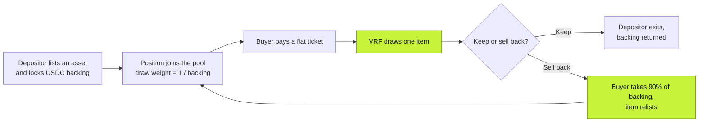

**An onchain gacha for NFTs and tokenized assets, built on one primitive: the backed position.**

[gabox.fun](https://gabox.fun) · [Docs](https://github.com/gabox-labs/docs) · [hello@gabox.fun](mailto:hello@gabox.fun)

Gabox pools real assets and sells random shots at them. Depositors list items they are willing to part with at a price. Buyers pay a flat ticket for a verifiably random draw at everything inside. The protocol sits in the middle, takes a small cut, and holds no risk of its own.

One number makes the whole thing work: **backing**, the USDC a depositor locks next to their item. That single number is the item's buyback bid, its draw odds, and the depositor's stake, all at once. Ticket price, draw weights, and exit liquidity all derive from it.

## The loop

1. **Deposit.** List an NFT or tokenized asset and lock USDC next to it. The backing is your own bid on your own item.
2. **Price.** The ticket tracks the pool's draw-weighted expected value (the harmonic mean of all backings) plus a 10% surcharge.
3. **Draw.** MagicBlock VRF picks exactly one position, with odds inverse to its backing. Cheap items hit constantly, richly backed grails rarely. The item lands in the buyer's wallet immediately.
4. **Keep or sell back.** Keep it and the depositor exits with their backing returned. Or sell it back on the spot for 90% of its backing in cash.

## The house cannot go broke

There is no house bankroll and no shared vault. Every buyback a buyer can claim is the depositor's own backing, locked in escrow before the item ever entered the pool. The protocol never promises money it is not already holding on someone's behalf.

- **No insolvency risk.** Every possible payout is collateralized before the draw.
- **No oracle risk.** Prices come from self-set backing, not floor-price feeds.
- **Provable fairness.** Onchain VRF, published odds, snapshot-frozen draws.
- **Guaranteed exit.** Any drawn item sells back instantly for 90% of its backing.

## At a glance

| | |
|---|---|
| **Assets** | NFTs and tokenized assets: graded cards, vaulted TCG, blue-chip PFPs |
| **Money** | USDC everywhere. Backing, bids, tickets, and fees never reprice on a SOL move |
| **Randomness** | MagicBlock VRF via CPI callback |
| **Protocol cut** | 1% of each ticket, plus 10% of backing on each sell-back |

## Status

> [!TIP]
> The program is code-complete and **live on devnet**, settling real draws against the real MagicBlock VRF oracle: backed positions, harmonic-mean pricing, keep-or-sell-back settlement, the five-rank crown board, and the full failure-path machinery.

Mainnet follows external code review and a Squads multisig upgrade authority. The [roadmap](https://github.com/gabox-labs/docs/blob/main/roadmap.mdx) has the full rollout.

---

Questions, feedback, grails to list: [hello@gabox.fun](mailto:hello@gabox.fun)

